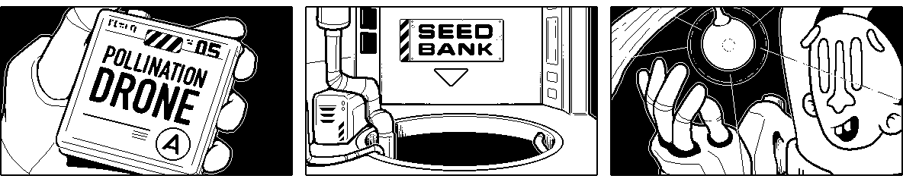

# Illumination

A [Panels](https://github.com/cadin/panels) mini-comic (for Playdate).

### 🕹 [Download _Illumination_ on Itch](https://cadinb.itch.io/illumination)

## Setup

This repo includes the Panels framework as a git submodule. Be sure to properly [initialize the submodule](https://www.w3docs.com/snippets/git/how-to-clone-including-submodules.html) when cloning the repo.

If you're not using git, you can download this code as a ZIP file. In that case you'll also need to download the code from the [Panels repo](https://github.com/cadin/panels) and place it in the `source/libraries/panels/` folder of this repo.

## Look Around

This project might be a useful example if you're attempting to create your own comic with Panels.
Check out the [`comicData`](https://cadin.github.io/panels/docs/comic-data/) tables in `source/comicData`. In this project I created a separate file for each sequence in the comic.

Layered assets are stored in `source/images`. I store art for each sequence in a separate folder and name each image according to the panel and layer order.

## Documentation

Check out the full documentation for Panels here:

### [📄 Panels Documentation](//cadin.github.io/panels)
